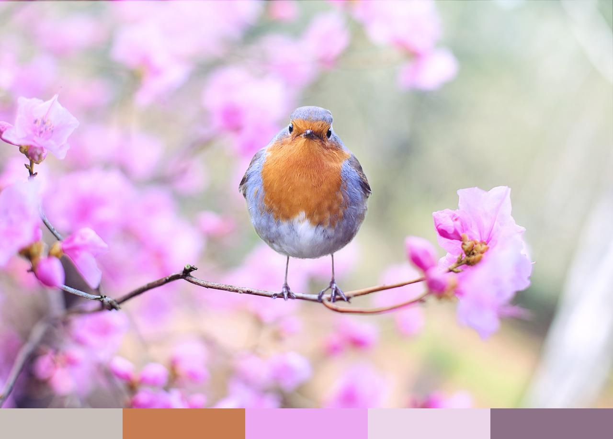
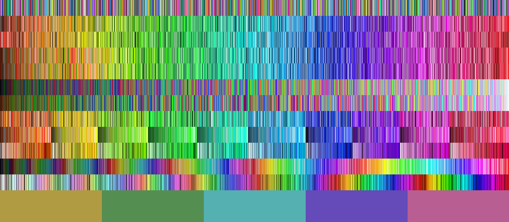

# ColorPalette

A color palette generator.

## About

Written in **python**, using **PIL** for reading/writing images. The color palette is chosen using the [**_k_-means clustering**](https://en.wikipedia.org/wiki/K-means_clustering) algorithm (in RGB space). 

**Note**: this is only a coding exercise (2017) and is _not_ intended for any practical use. The output palette is not very consistent.

## Usage

```
usage: colorpalette.py [-h] [-o OUTPUTPATH] [-c COLORS] path

positional arguments:
  path

optional arguments:
  -h, --help            show this help message and exit
  -o OUTPUTPATH, --outputpath OUTPUTPATH
  -c COLORS, --colors COLORS
```

## Demo

5 color palette:



7 colors color wheel palette (made with _```write_color_wheel()```_):


Color sorting algorithm tests (_```sorttest.py```)_:

